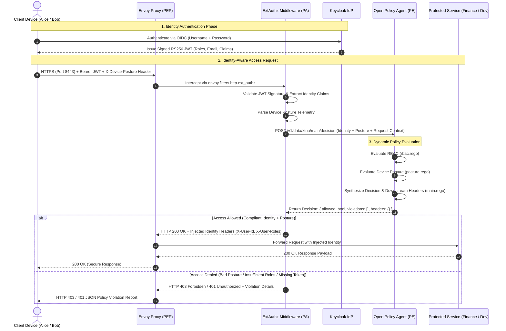

# Zero Trust Network Access (ZTNA) & Identity-Aware Microsegmentation Gateway
### *NIST SP 800-207 Compliant Identity-Aware Proxy & Dynamic Policy Enforcement Architecture*

[](https://github.com/ravishkarathnayaka/zero-trust-identity-aware-gateway/actions/workflows/ci.yml)
[](https://github.com/ravishkarathnayaka/zero-trust-identity-aware-gateway/actions/workflows/security-scan.yml)
[](https://opensource.org/licenses/MIT)
[](https://csrc.nist.gov/publications/detail/sp/800-207/final)
[](https://vercel.com)
[](https://www.openpolicyagent.org/)
[](https://www.envoyproxy.io/)

---

## Executive Summary

Traditional enterprise network security relies on perimeter defense ("castle-and-moat") paradigms—once a user authenticates through a Virtual Private Network (VPN), they gain broad, implicit lateral access across internal network subnets. This architectural flaw allows adversaries who compromise a single credential or device to move laterally across internal networks unimpeded.

This project implements an enterprise-grade **Zero Trust Network Access (ZTNA)** and **Identity-Aware Microsegmentation Gateway** strictly adhering to the tenets of **NIST SP 800-207**. Perimeter trust is eliminated entirely:
- Every transaction is dynamically evaluated before access is granted.
- Access requires strong user identity claims from an OpenID Connect (OIDC) Identity Provider (**Keycloak**).
- Devices must satisfy cryptographic verification and real-time posture telemetry (disk encryption, operating system version, patch level, and enterprise management).
- Internal workloads (`finance_api`, `dev_portal`) reside on an isolated Docker network with zero public port exposures, completely unreachable except through the **Envoy** Policy Enforcement Point (PEP).
- Policy decisions are determined by **Open Policy Agent (OPA)** written in modern Rego v1.

---

## NIST SP 800-207 Architecture & Request Lifecycle



---

## NIST SP 800-207 Component Mapping

| NIST SP 800-207 Component | Implementation In This Project | Role & Security Function |
| :--- | :--- | :--- |
| **Policy Enforcement Point (PEP)** | **Envoy Proxy v1.30** | Terminates TLS, intercepts ingress traffic, acts as perimeter proxy, enforces microsegmentation, and delegates auth to PA via `ext_authz`. |
| **Policy Administrator (PA)** | **ExtAuthz Service** (FastAPI) | Bridges Envoy PEP with Keycloak and OPA. Extracts claims, validates tokens, shapes posture context, and communicates PDP decisions back to the PEP. |
| **Policy Engine (PE)** | **Open Policy Agent (OPA)** | Pure declarative Policy Decision Point (PDP) executing Rego v1 rules for RBAC, ABAC, and device posture. |
| **Identity Provider (IdP)** | **Keycloak 24** | Central enterprise identity authority managing users, roles, credentials, and issuing cryptographically signed OIDC tokens. |
| **Protected Data Plane** | **Finance API & Dev Portal** | Containerized microservices isolated in `ztna_internal` Docker network without host port publishing. |
| **PKI / mTLS Trust** | **OpenSSL Root CA & Certs** | Internal CA issuing TLS certificates for Envoy and corporate device identity validation. |

---

## NIST SP 800-207 Tenets Implementation

1. **All data sources and computing services are considered resources**: Every internal microservice endpoint (`/api/finance/*`, `/api/dev/*`) is strictly guarded.
2. **All communication is secured regardless of network location**: Ingress traffic terminates over HTTPS (port 8443) using PKI certificates. Internal microservices reside on an isolated bridge network.
3. **Access to individual enterprise resources is granted on a per-session basis**: Every single HTTP request triggers an evaluation against OPA before reaching upstream services.
4. **Access is determined by dynamic policy**: Policies incorporate user identity, assigned roles, resource sensitivity tiers, and device posture attributes.
5. **The enterprise monitors and measures the integrity and security posture of all owned and associated assets**: Requests must supply compliant device posture signals (`encrypted=true`, valid operating systems, `patch_level=current`, and corporate management).
6. **All resource authentication and authorization are dynamic and strictly enforced before access is allowed**: Default-deny posture with fail-closed mechanics (`failure_mode_allow: false`).
7. **The enterprise collects as much information as possible about the current state of assets and uses it to improve security posture**: Structured JSON security audit events are emitted on every evaluation.

---

## Repository Structure

```
zero-trust-identity-aware-gateway/
├── .github/
│   └── workflows/
│       ├── ci.yml                # Automated CI: OPA policy tests, flake8 linting, pytest, compose validation
│       └── security-scan.yml     # SAST & Security: Gitleaks, Bandit Python scanner, Trivy IaC scan
├── docker/
│   ├── docker-compose.yml        # Multi-container orchestration (Envoy, Keycloak, OPA, ExtAuthz, Services)
│   ├── .env.example              # Environment variables template
│   └── certs/
│       ├── generate_certs.sh     # Bash script generating Root CA, Server TLS, and Client mTLS certs
│       └── generate_certs.ps1    # PowerShell native script for Windows certificate generation
├── gateway/
│   ├── envoy.yaml                # Envoy PEP configuration with ext_authz filter & TLS termination
│   └── ext_authz_service/        # Policy Administrator middleware
│       ├── __init__.py
│       ├── main.py               # Token verification, device posture parsing, OPA PDP query
│       ├── requirements.txt
│       └── Dockerfile
├── idp/
│   ├── realm-export.json         # Pre-configured Keycloak realm with Alice (Finance), Bob (Engineering)
│   └── clients.json              # OIDC client specifications
├── policies/
│   ├── rbac.rego                 # Microsegmentation & Role-Based Access Control logic
│   ├── posture.rego              # Device posture validation (disk encryption, patch level, OS)
│   ├── main.rego                 # Master policy combining identity, posture, and downstream headers
│   └── tests/
│       └── main_test.rego        # Rego unit test suite for 11 distinct authorization scenarios
├── services/
│   ├── finance_api/              # Protected Finance API microservice (restricted to finance-admin)
│   │   ├── app.py
│   │   ├── requirements.txt
│   │   └── Dockerfile
│   └── dev_portal/               # Protected Developer Portal microservice (restricted to engineering)
│       ├── app.py
│       ├── requirements.txt
│       └── Dockerfile
├── tests/
│   ├── test_gateway_rego.py      # Unit tests for ExtAuthz middleware and posture parsing
│   └── test_auth_flows.py        # End-to-end integration tests for authorized and denied flows
└── README.md                     # Architecture documentation and execution guide
```

---

## Pre-Configured Test Personas & Credentials

The Keycloak realm (`ztna-realm`) is pre-populated with the following accounts (all default to password `password123`):

| User | Department | Assigned Roles | Accessible Endpoints | Posture Requirements |
| :--- | :--- | :--- | :--- | :--- |
| `alice` | Finance | `finance-admin`, `user` | `/api/finance/ledger`<br>`/api/finance/payout` | **High Sensitivity**: Encrypted disk, corporate-managed, current patch level |
| `bob` | Engineering | `engineering`, `user` | `/api/dev/repositories`<br>`/api/dev/deployments` | **Medium Sensitivity**: Encrypted disk, current patch level |
| `charlie` | Compliance | `auditor`, `user` | `/api/finance/ledger` *(Read-only)* | **High Sensitivity**: Encrypted disk, corporate-managed, current patch level |
| `eve` | External Guest | `user` (no permissions) | None (Public endpoints only) | N/A |

---

## Quickstart: Running the Zero Trust Stack Locally

### Prerequisites
- [Docker Desktop](https://www.docker.com/) (Linux containers enabled)
- OpenSSL CLI

### Step 1: Generate PKI Certificates
Generate the internal Certificate Authority and Envoy TLS certificates:

**On Linux / macOS / Git Bash:**
```bash
cd docker
chmod +x certs/generate_certs.sh
./certs/generate_certs.sh
```

**On Windows (PowerShell):**
```powershell
cd docker
powershell -ExecutionPolicy Bypass -File certs\generate_certs.ps1
```

### Step 2: Initialize Environment Variables
```bash
cp .env.example .env
```

### Step 3: Launch Docker Compose Stack
```bash
docker compose up -d --build
```

Verify that all 5 microservices are healthy:
```bash
docker compose ps
```

Services exposed on host:
- **Envoy PEP Gateway**: `https://localhost:8443` (TLS) / `http://localhost:8000` (Plaintext)
- **Keycloak IdP Admin Console**: `http://localhost:8080` (`admin` / `admin`)
- **Open Policy Agent PDP**: `http://localhost:8181`

---

## Verification & Walkthrough Guide

### 1. Obtain an OIDC JWT Token from Keycloak

Use Direct Access Grants to obtain an access token:

**For Alice (Finance Lead):**
```bash
ALICE_TOKEN=$(curl -s -X POST "http://localhost:8080/realms/ztna-realm/protocol/openid-connect/token" \
  -H "Content-Type: application/x-www-form-urlencoded" \
  -d "client_id=ztna-gateway" \
  -d "client_secret=ztna-gateway-secret-dev-key" \
  -d "grant_type=password" \
  -d "username=alice" \
  -d "password=password123" | jq -r .access_token)
```

**For Bob (Senior Engineer):**
```bash
BOB_TOKEN=$(curl -s -X POST "http://localhost:8080/realms/ztna-realm/protocol/openid-connect/token" \
  -H "Content-Type: application/x-www-form-urlencoded" \
  -d "client_id=ztna-gateway" \
  -d "client_secret=ztna-gateway-secret-dev-key" \
  -d "grant_type=password" \
  -d "username=bob" \
  -d "password=password123" | jq -r .access_token)
```

---

### 2. Test Authorization Scenarios

#### Scenario A: Authorized Access (Alice + Compliant Corporate Device)
Alice accesses the Finance Ledger from an encrypted, corporate-managed Linux machine:

```bash
curl -k -i -X GET "https://localhost:8443/api/finance/ledger" \
  -H "Authorization: Bearer $ALICE_TOKEN" \
  -H "X-Device-Posture: encrypted=true,os=linux,patch_level=current,corporate_managed=true"
```

**Response (HTTP 200 OK):**
```json
{
  "service": "finance_api",
  "caller_identity": {
    "user": "alice",
    "roles": ["finance-admin", "user"],
    "auth_decision": "ALLOWED"
  },
  "records_count": 3,
  "ledger": [
    {
      "id": "TX-1001",
      "date": "2026-09-01",
      "description": "Enterprise Cloud Infrastructure Payment",
      "amount": 45200.0,
      "status": "SETTLED"
    }
  ],
  "security_classification": "RESTRICTED-TIER-1"
}
```

---

#### Scenario B: Conditional Denial via Device Posture (Alice + Unencrypted Device)
Even though Alice holds the `finance-admin` role, her device lacks disk encryption:

```bash
curl -k -i -X GET "https://localhost:8443/api/finance/ledger" \
  -H "Authorization: Bearer $ALICE_TOKEN" \
  -H "X-Device-Posture: encrypted=false,os=linux,patch_level=current,corporate_managed=true"
```

**Response (HTTP 403 Forbidden):**
```json
{
  "status": "DENIED",
  "error": "AccessDeniedByPolicy",
  "framework": "NIST-SP-800-207",
  "user": "alice",
  "target_resource": "/api/finance/ledger",
  "method": "GET",
  "policy_violations": [
    "Device Posture Violation: Disk encryption is disabled"
  ],
  "device_posture_evaluated": {
    "encrypted": false,
    "os": "linux",
    "patch_level": "current",
    "corporate_managed": true
  }
}
```

---

#### Scenario C: RBAC Microsegmentation Denial (Bob -> Finance API)
Bob attempts to access the Finance Ledger with a compliant device:

```bash
curl -k -i -X GET "https://localhost:8443/api/finance/ledger" \
  -H "Authorization: Bearer $BOB_TOKEN" \
  -H "X-Device-Posture: encrypted=true,os=linux,patch_level=current,corporate_managed=true"
```

**Response (HTTP 403 Forbidden):**
```json
{
  "status": "DENIED",
  "error": "AccessDeniedByPolicy",
  "framework": "NIST-SP-800-207",
  "user": "bob",
  "target_resource": "/api/finance/ledger",
  "method": "GET",
  "policy_violations": [
    "Access denied: Missing required role for Finance API"
  ]
}
```

---

#### Scenario D: Authorized Engineering Access (Bob -> Dev Portal)
Bob accesses the Engineering Developer Portal from a compliant Windows workstation:

```bash
curl -k -i -X GET "https://localhost:8443/api/dev/repositories" \
  -H "Authorization: Bearer $BOB_TOKEN" \
  -H "X-Device-Posture: encrypted=true,os=windows_11,patch_level=current,corporate_managed=true"
```

**Response (HTTP 200 OK):**
```json
{
  "service": "dev_portal",
  "caller": {
    "user": "bob",
    "roles": ["engineering", "user"],
    "decision": "ALLOWED"
  },
  "repositories_count": 3,
  "repositories": [
    {
      "id": "repo-01",
      "name": "zero-trust-identity-aware-gateway",
      "visibility": "INTERNAL",
      "build_status": "PASSING"
    }
  ]
}
```

---

#### Scenario E: Unauthenticated Access Rejection
An unauthenticated client attempts to query protected microservices without an Authorization header:

```bash
curl -k -i -X GET "https://localhost:8443/api/finance/ledger"
```

**Response (HTTP 401 Unauthorized):**
```http
HTTP/1.1 401 Unauthorized
www-authenticate: Bearer realm="ztna-gateway"
content-type: application/json

{
  "status": "UNAUTHORIZED",
  "error": "AuthenticationRequired",
  "detail": "Missing or malformed Authorization header",
  "target_resource": "/api/finance/ledger"
}
```

---

## Automated Test Suites

### 1. Run OPA Rego Unit Tests (11 Tests)
Execute declarative policy verification directly:

```bash
# If OPA CLI is installed locally:
opa test policies/ -v

# Or via Docker:
docker run --rm -v "${PWD}/policies:/policies" openpolicyagent/opa:latest test /policies -v
```

Output:
```
data.ztna.main_test.test_public_healthz_allowed: PASS
data.ztna.main_test.test_alice_finance_ledger_allowed: PASS
data.ztna.main_test.test_alice_finance_unencrypted_denied: PASS
data.ztna.main_test.test_alice_finance_outdated_patch_denied: PASS
data.ztna.main_test.test_alice_finance_unmanaged_device_denied: PASS
data.ztna.main_test.test_bob_dev_portal_allowed: PASS
data.ztna.main_test.test_bob_finance_denied: PASS
data.ztna.main_test.test_unauthenticated_request_denied: PASS
data.ztna.main_test.test_eve_no_roles_denied: PASS
data.ztna.main_test.test_auditor_finance_read_allowed: PASS
data.ztna.main_test.test_auditor_finance_mutation_denied: PASS
--------------------------------------------------------------------------------
PASS: 11/11
```

### 2. Run Python ExtAuthz & Integration Tests (21 Tests)
```bash
python -m pytest tests/ -v
```

Output:
```
tests/test_auth_flows.py::TestZeroTrustAuthorizationFlows::test_flow_1_alice_finance_compliant_laptop_allowed PASSED
tests/test_auth_flows.py::TestZeroTrustAuthorizationFlows::test_flow_2_alice_unencrypted_laptop_denied PASSED
tests/test_auth_flows.py::TestZeroTrustAuthorizationFlows::test_flow_3_alice_outdated_patch_level_denied PASSED
tests/test_auth_flows.py::TestZeroTrustAuthorizationFlows::test_flow_4_bob_engineering_dev_portal_allowed PASSED
tests/test_auth_flows.py::TestZeroTrustAuthorizationFlows::test_flow_5_bob_engineering_accessing_finance_api_denied PASSED
tests/test_auth_flows.py::TestZeroTrustAuthorizationFlows::test_flow_6_auditor_read_only_allowed PASSED
tests/test_auth_flows.py::TestZeroTrustAuthorizationFlows::test_flow_7_auditor_payout_mutation_denied PASSED
tests/test_auth_flows.py::TestZeroTrustAuthorizationFlows::test_flow_8_unauthenticated_request_rejected PASSED
tests/test_auth_flows.py::TestZeroTrustAuthorizationFlows::test_flow_9_expired_token_rejected PASSED
tests/test_gateway_rego.py::TestDevicePostureParser::test_default_posture_when_empty PASSED
...
======================= 21 passed in 0.52s =======================
```

---

## Security Audit Logging

For every access attempt, the Policy Administrator emits a structured JSON audit event compliant with NIST SP 800-207 continuous diagnostic requirements:

```json
{
  "timestamp": "2026-09-12T07:15:00.000Z",
  "event_type": "ZTNA_AUTHORIZATION_DECISION",
  "nist_component": "Policy Enforcement Point / Policy Administrator",
  "decision": "DENY",
  "subject": {
    "user": "alice",
    "roles": ["finance-admin", "user"],
    "client_ip": "172.24.0.1"
  },
  "device_posture": {
    "encrypted": false,
    "os": "linux",
    "patch_level": "current",
    "corporate_managed": true
  },
  "action": "GET",
  "resource": "/api/finance/ledger",
  "policy_violations": [
    "Device Posture Violation: Disk encryption is disabled"
  ]
}
```

---

## Interactive Frontend Web Portal & Vercel Hosting

This repository includes a standalone, high-performance interactive web portal designed with a distinct **Quantum Violet & Electric Indigo** theme (`web/`) to showcase the architecture and let users experiment with zero trust policy evaluations in real time.

### Key Portal Features:
1. **Interactive ZTNA Policy Simulator**:
   - Select identity personas (Alice, Bob, Charlie, Eve, Anonymous, Expired Token).
   - Toggle real-time device posture switches (Disk Encryption, Operating System, Patch Level, MDM Management).
   - Pick target microservices (`/api/finance/ledger`, `/api/dev/repositories`, etc.).
   - Send simulated requests through the Envoy PEP and observe the animated lifecycle flow, HTTP status codes, injected downstream headers, and mock service payloads.
2. **Live Security Audit Stream**:
   - Filterable real-time table displaying continuous authorization decisions, client IPs, posture data, and policy violation logs.
3. **Decoded JWT & OIDC Inspector**:
   - Inspects cryptographically signed RS256 token claims issued by Keycloak.
4. **Rego Policy Viewer**:
   - Interactive viewer for `rbac.rego`, `posture.rego`, and `main.rego` with highlighted rules and NIST tenet explanations.
5. **NIST SP 800-207 Scorecard**:
   - Detailed status mapping across all 7 core tenets.
6. **cURL Command Generator**:
   - Automatically builds ready-to-run curl commands matching the active simulator settings.

### Running the Web Portal Locally:
```bash
# Using Python built-in HTTP server:
python -m http.server 3000 --directory web

# Open in browser:
http://localhost:3000
```

### Hosting on Vercel:
The project includes a root [`vercel.json`](file:///f:/Projects/zero-trust-identity-aware-gateway/vercel.json) pre-configured with:
```json
{
  "version": 2,
  "cleanUrls": true,
  "outputDirectory": "web"
}
```

#### Option A: Deploy via Vercel Dashboard (1-Click)
1. Go to [Vercel](https://vercel.com) and click **"Add New Project"**.
2. Import your GitHub repository: `ravishkarathnayaka/zero-trust-identity-aware-gateway`.
3. Vercel automatically detects `vercel.json` and sets the output directory to `web/`.
4. Click **Deploy**. Your interactive showcase portal is live with a global CDN URL!

#### Option B: Deploy via Vercel CLI
```bash
npm install -g vercel
vercel login
vercel --prod
```

---

## License

This project is licensed under the [MIT License](LICENSE).

